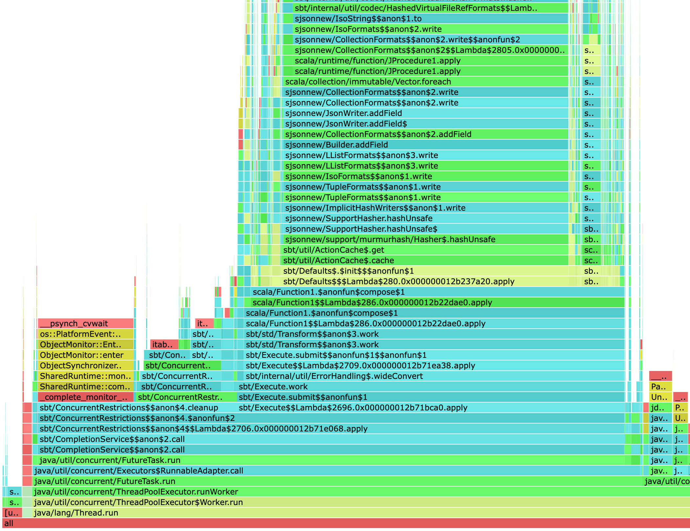

Profiling sbt
-------------

There are several ways to profile sbt. The new hotness in profiling is FlameGraph.
You first collect stack trace samples, and then it is processed into svg graph.
See:

- [Using FlameGraphs To Illuminate The JVM by Nitsan Wakart](https://www.youtube.com/watch?v=ugRrFdda_JQ)
- [USENIX ATC '17: Visualizing Performance with Flame Graphs](https://www.youtube.com/watch?v=D53T1Ejig1Q)

### jvm-profiling-tools/async-profiler

The first one I recommend is async-profiler. This is available for macOS and Linux,
and works fairly well. See their readme for the details, but see the following to get started.

1. Download the installer from <https://github.com/async-profiler/async-profiler/releases/tag/v4.2>
2. Make symbolic link from `asprof` and `jfrconv` to `$HOME/bin`, assuming you have PATH to `$HOME/bin`:

```bash
$ ln -s $HOME/Applications/async-profiler-4.2/bin/asprof $HOME/bin/asprof
$ ln -s $HOME/Applications/async-profiler-4.2/bin/jfrconv $HOME/bin/jfrconv
```

Next, close all Java applications and anything that may affect the profiling, and run sbt in one terminal:

```bash
$ sbt
```

In another terminal, run:

```bash
$ jps
92746 sbt-launch.jar
92780 Jps
```

This tells you the process ID of sbt. In this case, it's 92746. While it's running, run

```bash
$ asprof -d 60 <process-id>
Profiling for 60 seconds
Done
--- Execution profile ---
Total samples       : 26096

--- 66180000000 ns (25.36%), 6618 samples
  [ 0] java.lang.invoke.VarHandleByteArrayAsInts$ArrayHandle.index
  [ 1] java.lang.invoke.VarHandleByteArrayAsInts$ArrayHandle.get
  [ 2] java.lang.invoke.VarHandleGuards.guard_LI_I
  [ 3] sun.security.provider.ByteArrayAccess.b2iBig64
  [ 4] sun.security.provider.SHA2.implCompress0
  [ 5] sun.security.provider.SHA2.implCompress
  [ 6] sun.security.provider.DigestBase.implCompressMultiBlock0
  [ 7] sun.security.provider.DigestBase.implCompressMultiBlock
  [ 8] sun.security.provider.DigestBase.engineUpdate
  [ 9] java.security.MessageDigest$Delegate.engineUpdate
  [10] java.security.MessageDigest.update
  [11] java.security.DigestInputStream.read
  [12] java.io.FilterInputStream.read
  [13] sbt.internal.inc.HashUtil$.sha256Hash
  [14] sbt.internal.inc.HashUtil$.sha256HashStr
....
```

This should show a bunch of stacktraces that are useful.
To visualize this as a flamegraph, run:

```bash
$ asprof -d 60 -f /tmp/flamegraph.html <process id>
```

This should produce `/tmp/flamegraph.html` at the end.



### include line numbers

With Scala, sometimes you would get a method name that looks like `sbt/Defaults$.$init$$anonfun$1`, which we'd have no idea which lambda expression it is pointing to. One workaround is to include the line numbers into the flamegraph by first generating in the Java Flight Recorder format.

```bash
$ asprof -d 60 -f /tmp/flamegraph.jfr <process id>
$ jfrconv --lines /tmp/flamegraph.jfr /tmp/flamegraph.html
```

### running sbt with standby

One of the tricky things you come across while profiling is figuring out the process ID,
while wanting to profile the beginning of the application.

For this purpose, we've added `sbt.launcher.standby` JVM flag.
In the next version of sbt, you should be able to run:

```bash
$ sbt -J-Dsbt.launcher.standby=20s exit
```

This will count down for 20s before doing anything else.

### jvm-profiling-tools/perf-map-agent

If you want to try the mixed flamegraph, you can try perf-map-agent.
This uses `dtrace` on macOS and `perf` on Linux.

You first have to compile https://github.com/jvm-profiling-tools/perf-map-agent.
For macOS, here to how to export `JAVA_HOME` before running `cmake .`:

```bash
$ export JAVA_HOME=$(/usr/libexec/java_home)
$ cmake .
-- The C compiler identification is AppleClang 9.0.0.9000039
-- The CXX compiler identification is AppleClang 9.0.0.9000039
...
$ make
```

In addition, you have to git clone https://github.com/brendangregg/FlameGraph

In a fresh terminal, run sbt with `-XX:+PreserveFramePointer` flag:

```bash
$ sbt -J-Dsbt.launcher.standby=20s -J-XX:+PreserveFramePointer exit
```

In the terminal that you will run the perf-map:

```bash
$ cd quicktest/
$ export JAVA_HOME=$(/usr/libexec/java_home)
$ export FLAMEGRAPH_DIR=$HOME/work/FlameGraph
$ jps
94592 Jps
94549 sbt-launch.jar
$ $HOME/work/perf-map-agent/bin/dtrace-java-flames 94549
dtrace: system integrity protection is on, some features will not be available

dtrace: description 'profile-99 ' matched 2 probes
Flame graph SVG written to DTRACE_FLAME_OUTPUT='/Users/xxx/work/quicktest/flamegraph-94549.svg'.
```

This would produce better flamegraph in theory, but the output looks too messy for `sbt exit` case.
See https://gist.github.com/eed3si9n/b5856ff3d987655513380d1a551aa0df
This might be because it assumes that the operations are already JITed.

### ktoso/sbt-jmh

https://github.com/ktoso/sbt-jmh

Due to JIT warmup etc, benchmarking is difficult. JMH runs the same tests multiple times to
remove these effects and comes closer to measuring the performance of your code.

There's also an integration with jvm-profiling-tools/async-profiler, apparently.

### VisualVM

I'd also mention traditional JVM profiling tool. Since VisualVM is opensource,
I'll mention this one: https://visualvm.github.io/

1. First VisualVM.
2. Start sbt from a terminal.
3. You should see `xsbt.boot.Boot` under Local.
4. Open it, and select either sampler or profiler, and hit CPU button at the point when you want to start.

If you are familiar with YourKit, it also works similarly.
